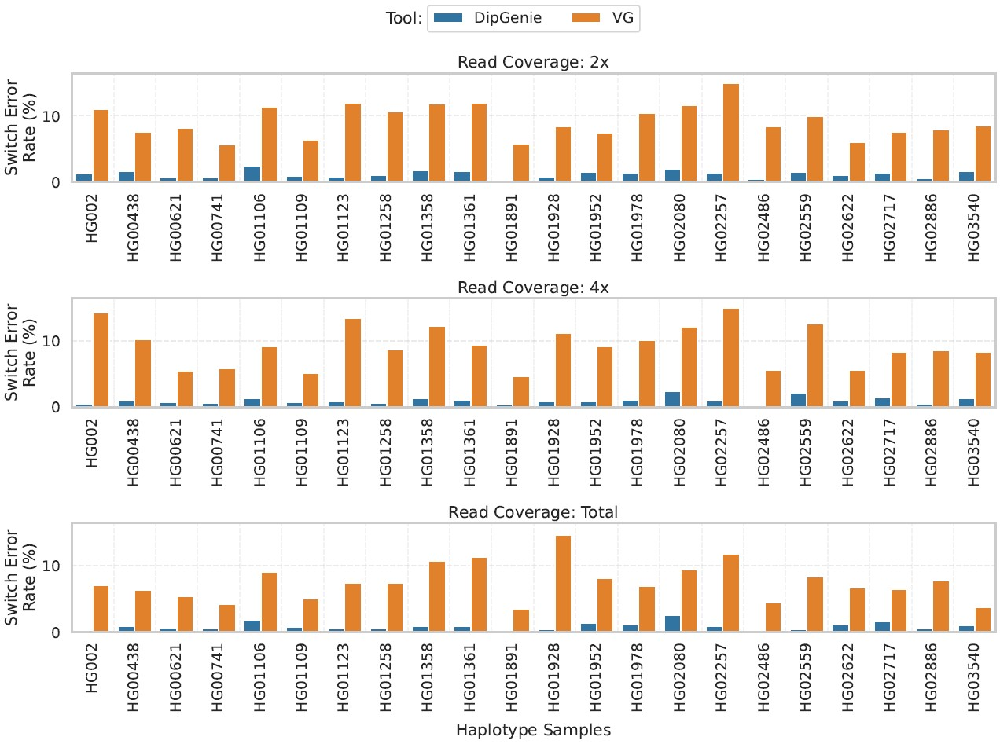
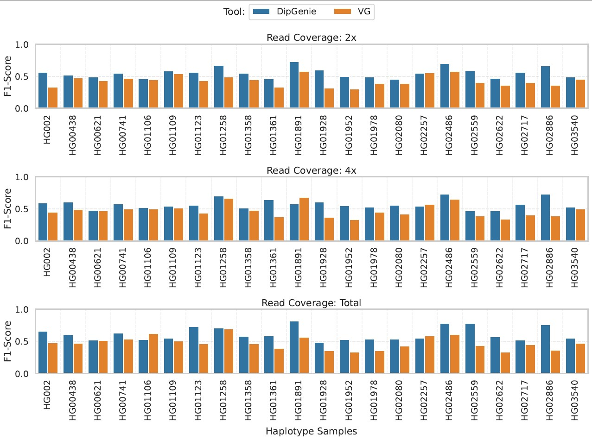

<div align="center">
  <!--  -->
</div>

## <div align="center"><span style="color:red;"><b>DipGenie</b></span> (<span style="color:red;"><b>D</b></span>iploid <span style="color:red;"><b>G</b></span>enome <span style="color:red;"><b>i</b></span>nference)</div>


## <a name="started"></a>Getting Started

### Prerequisites
- **Zlib** - [zlib](https://zlib.net/)


## Table of Contents

- [Get DipGenie](#get_dipgenie)
- [Introduction](#intro)
- [Results](#results)
- [Future work](#future)
- [Publications](#pub)


## <a name="get_dipgenie"></a>Get DipGenie

```bash
git clone https://github.com/gsc74/DipGenie
cd DipGenie
make

# Test runs
# For haploid
./DipGenie -t32 -p1 -g test/MHC_4.gfa.gz -r test/CHM13_reads.fq.gz -o CHM13
# For diploid
./DipGenie -t32 -p2 -R18 -g test/MHC_4.gfa.gz -r test/HG002.mhc.2x.fq.gz -o HG002

# test run with VCF file as input
./vcf2gfa.py -v test/MHC_4.vcf.gz -r test/MHC-CHM13.0.fa.gz | bgzip > test/MHC_4_vcf.gfa.gz
./DipGenie -t32 -p2 -R18 -g test/MHC_4_vcf.gfa.gz -r test/HG002.mhc.2x.fq.gz -o HG002
```

## <a name="intro"></a>Introduction
DipGenie is a tool designed to infer haplotypes using pangenome graphs. It estimates full haplotype sequences from low-coverage short-read sequencing data for both haploid and diploid genomes. Users may provide a pangenome reference in either of the following formats:

- Graph Format ([GFA v1.1](http://gfa-spec.github.io/GFA-spec/GFA1.html#gfa-11)): a sequence-graph representation of the pangenome.
- Variant Call Format ([VCF](https://samtools.github.io/hts-specs/VCFv4.2.pdf)): a set of phased, multi-allelic variants with a corresponding reference genome.

DipGenie outputs one (haploid) or two (diploid) inferred sequences in FASTA format, depending on the ploidy specified by the user. It identifies paths through the pangenome graphs that best explain the observed sequencing data by matching the (w, k)-minimizers (`w = 25`, `k = 31`) to the graph while enforcing a fixed number of recombination events (`R = 18` by default in diploid mode).


## <a name="results"></a>Results
We evaluated DipGenie (v1.0) using Illumina whole-genome reads from 22 diploid MHC samples and haplotype assemblies from all 24 samples. Haplotype assemblies were downloaded from [Zenodo](https://doi.org/10.5281/zenodo.6617246), and the sequencing reads were obtained from the [HPRC year-2 dataset](https://data.humanpangenome.org/raw-sequencing-data). Reads were aligned to GRCh38 using `minimap2`, and those mapping to the MHC region were extracted. Each read set was downsampled to coverages of 2×, 4×, and total.

We used a leave-one-out experimental setup to measure accuracy. For each of the 22 samples with reads, we built a pangenome graph excluding that sample and used CHM13 as the reference. The excluded haplotype assembly was used to generate a ground-truth VCF using `Cactus`, and test VCFs were produced from the inferred haplotypes generated by DipGenie and VG for the corresponding read sets.

The following tools were used to compute evaluation metrics:
- [`whatshap`](https://github.com/whatshap/whatshap) to compute the switch error rate (SER)
- [`truvari`](https://github.com/ACEnglish/truvari) to compute the F1-score for structural variant calling

SER measures phasing accuracy; lower values indicate better phasing quality. 


### Switch Error Rate (SER)

<p align="center">
  
</p>

> SER across different read coverages. DipGenie consistently achieves lower SER compared to VG.

### F1-Score for Structural Variant Calling

<p align="center">
  
</p>

> Comparison of F1-scores for structural variant calling using DipGenie and VG.

The scripts to reproduce the results are available [here](data). All datasets used for benchmarking are available at [Zenodo](https://doi.org/10.5281/zenodo.17685087). 


## <a name="future"></a>Future Work
- Add support for cyclic pangenome graphs.
- Parallelize the dynamic programming algorithm.


## <a name="pub"></a>Publications
- **Ghanshyam Chandra, William T. Doan and Daniel Gibney**. Haplotype-resolved diploid genome inference on pangenome graphs. *bioRxiv* (doi: [10.1101/2025.11.26.690754](https://doi.org/10.1101/2025.11.26.690754))
